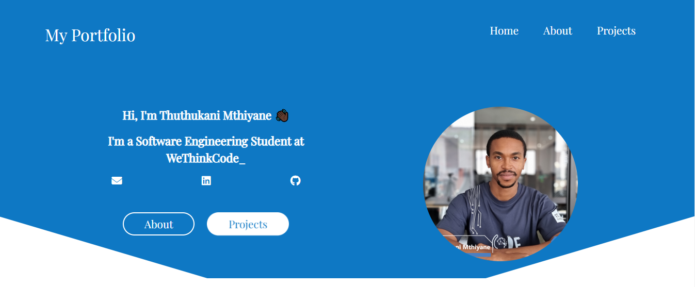

This is a simple SPA Portfolio and it was my first time using React.

## Preview


## Live Application URL

### https://friendly-rolypoly-cd8018.netlify.app
This URL has the application deployed in

## Prerequisites

### Install Node JS
Refer to https://nodejs.org/en/ to install nodejs

### Install create-react-app
Install create-react-app npm package globally. This will help to easily run the project and also build the source files easily. Use the following command to install create-react-app

```bash
npm install -g create-react-app
```

## How to use
1. Clone/Download the repo.
2. Run  ``` npm install ```.
3. Run ```npm start``` to start-up the up the local dev server port 3000.(http://localhost:3000).
5. HTML code is in  ```src/App.js```.

## Resources

**create-react-app** : The following link has all the commands that can be used with create-react-app
https://github.com/facebook/create-react-app

**ReactJS** : Refer to https://reactjs.org/ to understand the concepts of ReactJS

**React Bootstrap** : Refer to https://react-bootstrap.github.io/getting-started/introduction/ to understand how to use React Bootstrap
